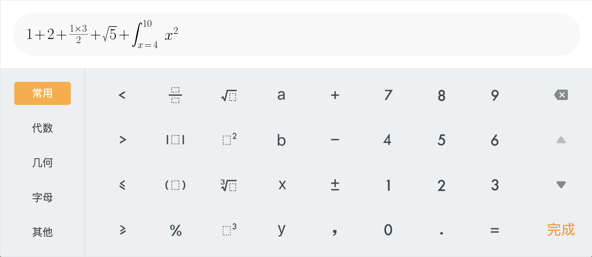
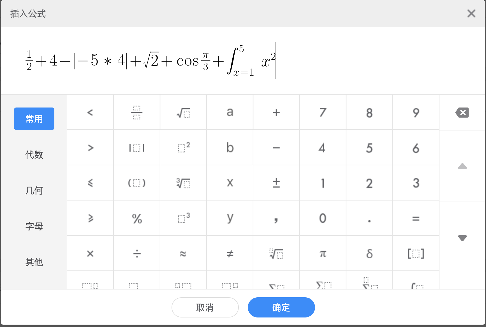

<h1 align="center">Welcome to formula-editor 👋</h1>

> 基于百度 kityformula-editor 开发的公式编辑器，有 android 和 web 两种模式

## 安装依赖

```sh
npm install
npm install -g anywhere // 随启随用的静态服务器
```

## 编译和运行程序

```sh
grunt build
anywhere -p {port} // 这里anywhere是为了开静态服务器，预览index.html
```

## 信令

[信令详情](./src/editor/command.md)

## 特性

设备类型：device - pc/android

```sh
{ip地址}:{port}?device=android
```

协议类型：protocol - iframe/webview/documentEvent

```sh
{ip地址}:{port}?protocol=webview
```

设备宽度：width

```sh
{ip地址}:{port}?width=1920
```

## 样式

#### 安卓：

```sh
{ip地址}:{port}?device=android&protocol=webview&width=1920
```



#### web：

```sh
{ip地址}:{port}?device=pc&protocol=documentEvent&width=1920
```



老铁，走过路过给个 ⭐️

点个 ⭐️，不迷路

---

_This README was generated with ❤️ by [readme-md-generator](https://github.com/kefranabg/readme-md-generator)_
